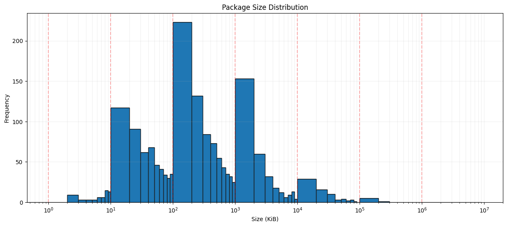

# Benford's Law

A beginner's journey to using AI for data exploration.

State of the art as of: 2025/03/14

## Motivation

_Inspired_ by watching pacman upgrade logs and having watched a [fantastic TV series about maths](https://www.arte.tv/de/videos/RC-021426/mathewelten/), I tried out, what [Cursor IDE](https://www.cursor.com/) is able to do and to help me to prove (or refute), that ["Benford's Law"](https://en.wikipedia.org/wiki/Benford%27s_law) holds for the package's file sizes.

In a first session, the AI returned amazing plots ... that contained a major bug, because the script also recognizes `MiB/s` as a file size, which I - in turn - noticed by running a AI generated jupyter notebook.

This notebook can be used to produce these two insightfull plots




**Note:** I did the part with the logarithmic scale, Cursor failed on that dramatically.

## Jupyter Notebook

As Cursor IDE told me:

> 1. First install Jupyter Notebook if you haven't already:
>    `pip install notebook numpy matplotlib`
>
> 2. Then launch Jupyter Notebook by running:
>    `jupyter notebook`
>    (not by trying to run the .ipynb file directly)
>
> 3. This will open your web browser with the Jupyter interface. Navigate to where you saved your `notebook. ipynb` file and click on it to open.

## Other findings

* AI sucks at [regular expressions](https://xkcd.com/208/), see [here](https://github.com/yuszuv/benford/commit/d42ee99021c97e596729e2cb8e514ede727471e6)
* AI can't fit logarithmic curves to data

## Cursor IDE prompts

In previous chat (whose history I have delete unfortunatley) i explored a pacman.log to reason about, if "Benford's Law" holds for the sizes of arch linux package upgrades. On the way I created (in that order), benford.py, histogram.py and histogram.go. At the end, I chatted with you about, why the law probably doesn't hold for small and very large file sizes.

help me to turn my results into a jupyter notebook.

> returned _more or less the complete notebook here_

there's a bug in the script. the regular expression also matches the the download speed (the column next to the size). correct this

> _`pattern = r'(\d+(?:\.\d+)?)\s*(MiB|KiB)\s+[^\n]*$'`_

use a look ahead assertion instead

> _`pattern = r'(\d+(?:\.\d+)?)\s*(MiB|KiB)(?=\s+\d+(?:\.\d+)?\s*MiB/s)'`_

use a negative look ahead asseration to match any but "MiB" followed by "/s"

> _`pattern = r'(\d+(?:\.\d+)?)\s*(MiB|KiB)(?!\s+MiB/s)'`_

did you mean `pattern = r'(\d+(?:\.\d+)?)\s\*(MiB|KiB)(?!/s)'`?

> _returned a praise of me_

add this negative look ahead assertion to the go version

> _`sizeRegex := regexp.MustCompile(`(\d+(?:\.\d+)?)\s\*(MiB|KiB)(?!/s)`)`, which [doesn't work](https://stackoverflow.com/questions/26771592/negative-look-ahead-in-go-regular-expressions)_

this returns: panic: regexp: Compile(`(\d+(?:\.\d+)?)\s*(MiB|KiB)(?!\/s)`): error parsing regexp: invalid or unsupported Perl syntax: `(?!`

> ```
>    sizeRegex := regexp.MustCompile(`(\d+(?:\.\d+)?)\s*(MiB|KiB)`)
>    speedRegex := regexp.MustCompile(`/s`)
>
>    ...
>
>        if len(matches) >= 3 && !speedRegex.MatchString(matches[0]) {
>    ...

